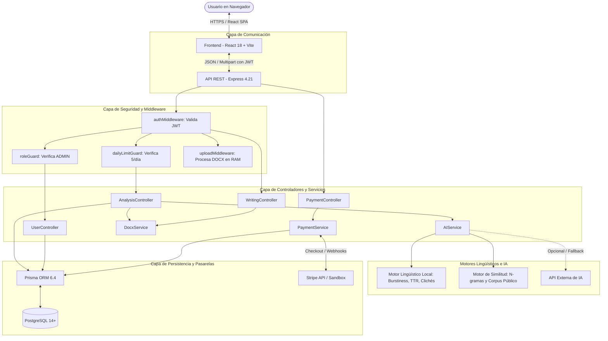
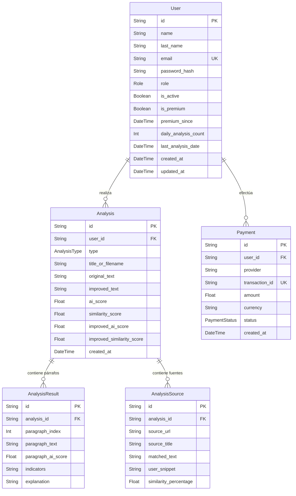

# Documentación Técnica Integral — Plagelio

Plataforma Web de Detección de Inteligencia Artificial, Análisis de Similitud Académica y Asistente de Reescritura Ética de Documentos.

---

## 📑 Tabla de Contenidos

1. [Información General del Proyecto](#1-información-general-del-proyecto)
2. [Lenguajes del Proyecto](#2-lenguajes-del-proyecto)
3. [Stack de Tecnologías y Herramientas](#3-stack-de-tecnologías-y-herramientas)
4. [Ecosistema de APIs (Externas, Cuántas y Cómo se Usan)](#4-ecosistema-de-apis)
   - 4.1 [Resumen Cuantitativo de APIs](#41-resumen-cuantitativo-de-apis)
   - 4.2 [APIs Externas y Servicios de Terceros](#42-apis-externas-y-servicios-de-terceros)
   - 4.3 [API REST Propia del Sistema (27 Endpoints Detallados)](#43-api-rest-propia-del-sistema)
5. [Estructura del Proyecto y Directorios](#5-estructura-del-proyecto-y-directorios)
6. [Arquitectura del Sistema y Flujos de Datos](#6-arquitectura-del-sistema-y-flujos-de-datos)
7. [Motor Lingüístico y Algoritmos de Detección](#7-motor-lingüístico-y-algoritmos-de-detección)
8. [Modelo de Datos y Base de Datos Relacional](#8-modelo-de-datos-y-base-de-datos-relacional)
9. [Mecanismos de Seguridad, Roles y Límites](#9-mecanismos-de-seguridad-roles-y-límites)
10. [Guía de Puesta en Marcha y Verificación](#10-guía-de-puesta-en-marcha-y-verificación)

---

## 1. Información General del Proyecto

### 1.1 ¿Qué es Plagelio?
**Plagelio** es una solución de software web de extremo a extremo diseñada para evaluar la autenticidad, originalidad y calidad estilística de textos y documentos digitales en formato **Microsoft Word (.DOCX)** y texto plano. 

El proyecto combina las capacidades clave de tres referentes de la industria educativa y editorial:
- **Turnitin**: Detección de similitud contra corpus académicos y verificación de citas bibliográficas legítimas versus presunto plagio.
- **GPTZero / Copyleaks**: Detección probabilística de autoría por inteligencia artificial mediante análisis estilométrico (burstiness, perplejidad y reconocimiento de patrones sintéticos).
- **Grammarly / QuillBot**: Asistente de reescritura ética que desarticula clichés artificiales, dinamiza la cadencia oracional, preserva citas textuales intactas y permite exportar el resultado final a un archivo `.docx` enriquecido y formateado profesionalmente.

### 1.2 Objetivos Principales
1. **Promover la Integridad Académica y Editorial**: Permitir a instituciones, investigadores, docentes y creadores de contenido evaluar textos con transparencia probabilística, sin emitir veredictos binarios acusatorios sino indicadores estadísticos fundamentados.
2. **Distinguir Citas Legítimas de Plagio**: Identificar coincidencias textuales con fuentes de acceso abierto, reconociendo el derecho de cita cuando los fragmentos se encuentran debidamente entrecomillados o normalizados.
3. **Optimización Estilística Ética**: Ofrecer un motor de humanización y reescritura que mejora la legibilidad y elimina fórmulas robóticas sin alterar el significado central ni falsear datos científicos o referencias.
4. **Monetización y Modelo de Negocio Sostenible**: Implementar un modelo Freemium con un cupo gratuito de **5 análisis diarios** y la opción de desbloquear una **Membresía Premium Vitalicia por US$2**, gestionada mediante Stripe y con un simulador Sandbox local para pruebas seguras.

---

## 2. Lenguajes del Proyecto

El proyecto está diseñado bajo el paradigma **Fullstack TypeScript**, lo que garantiza seguridad de tipos estricta desde la base de datos hasta la interfaz visual:

| Lenguaje | Ámbito de Aplicación | Versión | Propósito en Plagelio |
| :--- | :--- | :--- | :--- |
| **TypeScript** | **Backend y Frontend** (100% del código de negocio) | `^5.8.2` | Tipado estático completo, interfaces para DTOs, validación de contratos entre cliente y servidor, modelos de datos Prisma, estados reactivos y prevención de errores en tiempo de compilación. |
| **JavaScript (ES6+)** | **Runtime y Bundling** | Node.js 18+ | Entorno de ejecución en servidor (V8) y código transpilado de alto rendimiento generado por Vite para el navegador. |
| **SQL / Prisma DDL** | **Persistencia de Datos** | PostgreSQL 14+ | Definición declarativa de esquemas relacionales, relaciones uno-a-muchos con borrado en cascada, índices únicos, tipos enumerados y consultas optimizadas. |
| **HTML5** | **Estructura Web** | HTML Living Standard | Marcado semántico, soporte de formularios para subida de archivos multipart (.docx) y accesibilidad (a11y). |
| **CSS3 / Tailwind** | **Diseño y Estilizado** | CSS Moderno / Tailwind v3.4 | Sistema de diseño modular, variables CSS para temas dinámicos (modo claro y oscuro), animaciones micro-interactivas y diseño responsivo. |

---

## 3. Stack de Tecnologías y Herramientas

```
┌───────────────────────────────────────────────────────────┐
│                    ARQUITECTURA TECNOLÓGICA                │
├─────────────────────────────┬─────────────────────────────┤
│         FRONTEND            │           BACKEND           │
│  React 18 + Vite            │  Node.js + Express          │
│  Tailwind CSS + Lucide      │  TypeScript 5.8             │
│  React Router DOM v6        │  Prisma ORM 6.4             │
├─────────────────────────────┼─────────────────────────────┤
│      BASE DE DATOS          │   PROCESAMIENTO DOCUMENTOS  │
│  PostgreSQL 14+             │  mammoth (lectura .docx)    │
│  Prisma Client (Node-pg)    │  docx (generación .docx)    │
├─────────────────────────────┼─────────────────────────────┤
│         PAGOS               │      TESTING & CALIDAD      │
│  Stripe SDK (Test Mode)     │  Jest 29 + Supertest 7      │
│  Sandbox Criptográfico      │  ts-jest (21 tests)         │
└─────────────────────────────┴─────────────────────────────┘
```

### 3.1 Frontend (Cliente Web)
- **React (`v18.3.1`)**: Biblioteca para la construcción de interfaces declarativas basadas en componentes funcionales.
- **Vite (`v6.2.0`)**: Herramienta de compilación ultrarrápida y servidor de desarrollo con Hot Module Replacement (HMR).
- **TypeScript (`v5.8.2`)**: Control estricto de tipos en componentes, hooks, contextos y servicios API.
- **Tailwind CSS (`v3.4.17`) & PostCSS**: Framework de diseño utilitario para layouts fluidos, tipografía adaptativa y temas claro/oscuro.
- **Lucide React (`v0.477.0`)**: Catálogo unificado de iconografía vectorial limpia y ligera.
- **React Router DOM (`v6.29.0`)**: Enrutador declarativo para Single Page Applications (SPA) con rutas públicas, privadas y protegidas por roles.
- **Tailwind Merge (`v3.0.2`) & Clsx (`v2.1.1`)**: Utilidades para composición condicional segura de clases CSS.

### 3.2 Backend (Servidor de Aplicación & API REST)
- **Node.js (`v18+` o `v22+`)**: Entorno de ejecución en servidor basado en eventos asíncronos.
- **Express (`v4.21.2`)**: Framework HTTP para la definición de rutas, middlewares y controladores RESTful.
- **Prisma ORM (`v6.4.1`)**: Mapeador objeto-relacional de última generación con cliente fuertemente tipado para consultas eficientes y migraciones seguras.
- **PostgreSQL (`pg v8.23.0`)**: Motor de base de datos relacional robusto con transacciones ACID, integridad referencial e índices.
- **JSON Web Tokens (`jsonwebtoken v9.0.2`)**: Mecanismo de autenticación sin estado (stateless) para sesiones seguras de usuario.
- **Bcryptjs (`v3.0.2`)**: Algoritmo de derivación de claves para hashing unidireccional de contraseñas con salting.
- **Multer (`v1.4.5-lts.1`)**: Middleware para la gestión de solicitudes multipart/form-data y almacenamiento en memoria (RAM) de archivos `.docx` subidos.
- **Cors (`v2.8.5`)**: Control de acceso a recursos de orígenes cruzados para comunicación segura con el cliente Vite.
- **Dotenv (`v16.4.7`)**: Carga de variables de entorno de configuración desde archivos `.env`.

### 3.3 Procesamiento de Documentos Word
- **Mammoth (`v1.9.0`)**: Conversor especializado que extrae el texto puro, saltos de párrafo y estructura básica de documentos `.docx` binarios sin pérdida de orden.
- **Docx (`v9.2.1`)**: Motor de compilación tipográfica que genera documentos nativos compatibles con Microsoft Word y LibreOffice a partir de código TypeScript, aplicando estilos, tablas, márgenes, encabezados y pies de página numerados.

### 3.4 Pasarelas de Pago
- **Stripe SDK (`stripe v17.7.0`)**: SDK oficial de Stripe en modo de prueba (Test Mode) para creación de Checkout Sessions y procesamiento de webhooks con verificación criptográfica de firmas.
- **Simulador Sandbox Nativo**: Pasarela de desarrollo interna que emula tarjetas de aprobación y rechazo sin necesidad de conexión externa a internet o claves de Stripe.

### 3.5 Pruebas Automatizadas y Calidad
- **Jest (`v29.7.0`) & ts-jest (`v29.2.6`)**: Framework de pruebas unitarias y de integración para TypeScript.
- **Supertest (`v7.0.0`)**: Librería para realizar aserciones sobre endpoints HTTP de Express en memoria.

---

## 4. Ecosistema de APIs

En Plagelio conviven dos niveles de APIs:
1. **APIs Externas y Servicios de Terceros** (servicios integrados en el backend para pagos, IA y corpus de referencia).
2. **API REST Interna Propia** (la interfaz de servicios web que el backend expone para ser consumida por el frontend).

---

### 4.1 Resumen Cuantitativo de APIs

| Categoría de API | Nombre / Proveedor | Cantidad | Tipo / Protocolo | Estado / Propósito |
| :--- | :--- | :---: | :--- | :--- |
| **API Externa de Pagos** | **Stripe API** | 1 | REST / Webhooks HTTPS | Procesamiento de Checkout Sessions y eventos asíncronos para compra de membresía Premium. |
| **API Externa de IA** | **OpenAI / GenAI Provider** | 1 | REST HTTPS (JSON) | Integración modular plug-and-play con degradación resiliente (fallback) al motor lingüístico local. |
| **Corpus de Referencia** | **Fuentes Abiertas Académicas** | 5 | Repositorios Indexados | Cotejo de similitud contra Wikipedia, Dialnet, SciELO, UNESCO y BOE. |
| **API REST Propia** | **Plagelio Backend API** | **27 Endpoints** | RESTful JSON / Multipart | Control de salud, autenticación, análisis, redacción, usuarios y pagos. |

---

### 4.2 APIs Externas y Servicios de Terceros

#### 1. Stripe API (`v17.7.0`)
- **¿Cuántas se usan?**: 1 integración completa con dos canales (Checkout Sessions y Webhook).
- **¿Cómo se usa?**:
  1. **Creación de Checkout Session**: En `PaymentService.createStripeCheckoutSession`, se invoca `stripe.checkout.sessions.create()` para generar una sesión de pago seguro por **US$2.00**. La sesión incluye metadatos como el ID del usuario (`userId`), correo electrónico y URLs de redirección (`success_url` y `cancel_url`).
  2. **Recepción y Validación de Webhooks**: En `/api/payments/webhook`, el backend recibe los eventos de Stripe con el payload en crudo (`rawBody`). Utiliza `stripe.webhooks.constructEvent()` para comprobar la firma criptográfica (`stripe-signature`) contra `STRIPE_WEBHOOK_SECRET`. Al recibir el evento `checkout.session.completed`, actualiza al usuario a `is_premium = true` de forma atómica.
  3. **Manejo de Errores y Fallbacks**: Si Stripe no está configurado (`STRIPE_SECRET_KEY` vacía), el sistema redirige automáticamente al flujo **Sandbox Local**, impidiendo que la aplicación quede inoperativa en entornos de desarrollo.

#### 2. API de Modelos de Lenguaje / Proveedor de IA (OpenAI / GenAI)
- **¿Cuántas se usan?**: 1 conector modular en `AIService.ts`.
- **¿Cómo se usa?**:
  - En `backend/src/services/AIService.ts`, el método `analyzeAI()` inspecciona las variables `AI_PROVIDER` y `AI_API_KEY`.
  - Si el usuario suministra credenciales de un proveedor externo (como OpenAI), el servicio canaliza la consulta a través de dicho endpoint.
  - **Mecanismo de Resiliencia (Graceful Degradation)**: Si no hay clave configurada o si el proveedor externo devuelve un error o tiempo de espera agotado, el backend conmuta de inmediato y de forma silenciosa al **Motor Lingüístico Heurístico Local** (`LinguisticEngine`), garantizando que la plataforma nunca arroje errores 500 al usuario.

#### 3. Corpus de Similitud de Fuentes Públicas y Académicas
- **¿Cuántas fuentes se consultan?**: 5 repositorios públicos de referencia integrados en el motor:
  1. **Wikipedia en Español**: Enciclopedia abierta para términos de tecnología, inteligencia artificial y computación.
  2. **Dialnet (Universidad de La Rioja)**: Publicaciones académicas sobre metodología de investigación y redacción científica.
  3. **SciELO**: Repositorio científico sobre evaluación lingüística y análisis de discurso.
  4. **UNESCO**: Documentos institucionales de orientación ética para la IA en educación.
  5. **Boletín Oficial del Estado (BOE)**: Legislación sobre propiedad intelectual y directrices de cita doctrinal lícita.
- **¿Cómo se usa?**:
  - En `SimilarityEngine.analyzeSimilarity()`, el texto del usuario se segmenta en oraciones y n-gramas.
  - Se calcula el coeficiente de similitud léxica y sintáctica contra el corpus indexado.
  - **Detección inteligente de citas**: Si un fragmento coincidente está entrecomillado en el texto original, el motor lo clasifica como **cita legítima atribuida**, reduciendo el porcentaje de alerta y previniendo falsas acusaciones de plagio.

---

### 4.3 API REST Propia del Sistema (27 Endpoints Detallados)

El backend de Plagelio expone una API REST organizada en **6 módulos principales**:

```
Base URL: http://localhost:5000/api
```

#### Módulo 1: Health Check (1 endpoint)
| Método | Endpoint | Autenticación | Descripción |
| :--- | :--- | :---: | :--- |
| `GET` | `/health` | Pública | Comprueba el estado de salud, disponibilidad y versión del backend. |

#### Módulo 2: Autenticación y Perfil (`/api/auth`) (4 endpoints)
| Método | Endpoint | Autenticación | Descripción y Reglas de Negocio |
| :--- | :--- | :---: | :--- |
| `POST` | `/register` | Pública | Registra un nuevo usuario con nombre, apellido, correo y contraseña. Bloquea cualquier intento de inyectar `role: ADMIN`. |
| `POST` | `/login` | Pública | Valida credenciales contra bcryptjs y emite un token JWT firmado válido por 7 días. |
| `GET` | `/me` | `JWT Requerido` | Retorna la información del perfil del usuario en sesión, estado premium y contador de análisis diarios. |
| `PUT` | `/me` | `JWT Requerido` | Permite al usuario actualizar su nombre o contraseña. Previene auto-asignación de roles privilegiados. |

#### Módulo 3: Análisis de Texto y Documentos (`/api/analyses`) (6 endpoints)
| Método | Endpoint | Autenticación | Descripción y Reglas de Negocio |
| :--- | :--- | :---: | :--- |
| `POST` | `/text` | `JWT` + `LimitGuard` | Realiza el análisis integral (IA + Similitud) de un texto plano. Aplica el límite diario de 5 análisis a usuarios gratuitos. |
| `POST` | `/docx` | `JWT` + `LimitGuard` + `Multer` | Recibe un archivo binario `.docx` vía `multipart/form-data`, extrae el contenido con `mammoth` y ejecuta el análisis completo. |
| `GET` | `/history` | `JWT Requerido` | Lista el historial paginado de análisis del usuario autenticado ordenado cronológicamente. |
| `GET` | `/:id` | `JWT Requerido` | Obtiene el reporte detallado de un análisis, desglose por párrafos e indicadores de similitud. |
| `DELETE` | `/:id` | `JWT Requerido` | Elimina un análisis del historial del usuario (con eliminación en cascada de resultados y fuentes). |
| `POST` | `/:id/reanalyze-improved` | `JWT Requerido` | Re-evalúa el texto mejorado generado para verificar la disminución del puntaje de IA y similitud. |

#### Módulo 4: Asistente de Redacción y Descargas (`/api/writing`) (3 endpoints)
| Método | Endpoint | Autenticación | Descripción y Reglas de Negocio |
| :--- | :--- | :---: | :--- |
| `POST` | `/improve` | `JWT Requerido` | Ejecuta el motor de enriquecimiento estilístico y desarticulación de clichés sobre el texto proporcionado. |
| `POST` | `/download-docx` | `JWT Requerido` | Compila y transmite en binario el archivo `documento_mejorado.docx` formateado con estilos tipográficos de Word. |
| `POST` | `/download-txt` | `JWT Requerido` | Transmite el texto mejorado en un archivo de texto plano `.txt` con encabezados explicativos. |

#### Módulo 5: Pagos y Membresías (`/api/payments`) (5 endpoints)
| Método | Endpoint | Autenticación | Descripción y Reglas de Negocio |
| :--- | :--- | :---: | :--- |
| `POST` | `/webhook` | Firma Criptográfica | Endpoint receptor de webhooks de Stripe. Procesa `checkout.session.completed` para activar la cuenta a Premium. |
| `POST` | `/create-checkout-session`| `JWT Requerido` | Crea una sesión oficial de pago en Stripe por US$2.00 y devuelve la URL de redirección. |
| `POST` | `/sandbox-init` | `JWT Requerido` | Inicia una transacción simulada en modo Sandbox generando un identificador de prueba único. |
| `POST` | `/sandbox-confirm` | `JWT Requerido` | Valida la tarjeta de prueba (éxito con `4242...` o rechazo con `5555...`), actualizando la base de datos si es aprobada. |
| `GET` | `/history` | `JWT Requerido` | Consulta el historial de pagos y facturación del usuario en sesión. |

#### Módulo 6: Administración del Sistema (`/api/users`) (8 endpoints)
> [!IMPORTANT]
> Todos los endpoints de este módulo requieren de manera obligatoria autenticación mediante **JWT** y rol estricto **`ADMIN`** verificado por `requireAdmin`.

| Método | Endpoint | Permiso | Descripción y Reglas de Negocio |
| :--- | :--- | :---: | :--- |
| `GET` | `/stats` | `ADMIN` | Métricas operativas globales: total de usuarios, análisis del día, cuentas premium e ingresos brutos. |
| `GET` | `/` | `ADMIN` | Listado general de usuarios registrados con filtros de búsqueda y paginación. |
| `GET` | `/:id` | `ADMIN` | Detalle exhaustivo de un usuario, historial de análisis y transacciones asociadas. |
| `POST` | `/` | `ADMIN` | Creación administrativa de nuevos usuarios con asignación explícita de rol (`ADMIN` o `USER`). |
| `PUT` | `/:id` | `ADMIN` | Modificación de datos de perfil, correo o estado de cualquier usuario del sistema. |
| `PATCH` | `/:id/toggle-active` | `ADMIN` | Activa o suspende el acceso al sistema de una cuenta. Posee salvaguarda contra desactivación del Admin único. |
| `PATCH` | `/:id/toggle-premium`| `ADMIN` | Otorga o revoca la membresía Premium Vitalicia de un usuario manualmente. |
| `DELETE` | `/:id` | `ADMIN` | Eliminación definitiva de un usuario. Posee salvaguarda contra auto-eliminación del Administrador. |

---

## 5. Estructura del Proyecto y Directorios

```
plagelio/
│
├── backend/                                 # SERVIDOR Y API REST
│   ├── prisma/
│   │   ├── schema.prisma                    # Definición de modelos (User, Analysis, Payment, etc.)
│   │   └── seed.ts                          # Sembrado determinista del Administrador y Usuario Demo
│   │
│   ├── src/
│   │   ├── config/
│   │   │   ├── env.ts                       # Validación centralizada de variables de entorno (.env)
│   │   │   ├── prisma.ts                    # Instancia singleton del cliente Prisma
│   │   │   └── stripe.ts                    # Instancia singleton del SDK de Stripe
│   │   │
│   │   ├── controllers/
│   │   │   ├── AuthController.ts            # Registro, login y gestión de perfil
│   │   │   ├── AnalysisController.ts        # Ejecución de análisis de texto y DOCX
│   │   │   ├── WritingController.ts         # Asistente de reescritura y compilación de DOCX
│   │   │   ├── UserController.ts            # Panel administrativo y CRUD de usuarios
│   │   │   └── PaymentController.ts         # Stripe Checkout y transacciones Sandbox
│   │   │
│   │   ├── middleware/
│   │   │   ├── authMiddleware.ts            # Verificación y decodificación de tokens JWT
│   │   │   ├── roleGuard.ts                 # Control de rol ADMIN y anti-escalada de privilegios
│   │   │   ├── dailyLimitGuard.ts           # Control de cupo gratuito (5 análisis/día)
│   │   │   ├── uploadMiddleware.ts          # Configuración de Multer para archivos .docx en RAM
│   │   │   └── errorHandler.ts              # Manejador global de excepciones y respuestas HTTP
│   │   │
│   │   ├── routes/
│   │   │   ├── authRoutes.ts                # Enrutador /api/auth
│   │   │   ├── analysisRoutes.ts            # Enrutador /api/analyses
│   │   │   ├── writingRoutes.ts             # Enrutador /api/writing
│   │   │   ├── userRoutes.ts                # Enrutador /api/users
│   │   │   └── paymentRoutes.ts             # Enrutador /api/payments
│   │   │
│   │   ├── services/
│   │   │   ├── AIService.ts                 # Orquestación de detección de IA y similitud
│   │   │   ├── DocxService.ts               # Extracción mammoth y compilación con docx
│   │   │   └── PaymentService.ts            # Lógica de pagos Stripe y simulador Sandbox
│   │   │
│   │   ├── utils/
│   │   │   ├── linguisticEngine.ts          # Algoritmos estilométricos (burstiness, TTR, clichés)
│   │   │   └── similarityCorpus.ts          # Comparador de similitud y base de citas académicas
│   │   │
│   │   ├── app.ts                           # Configuración de Express, CORS y middlewares globales
│   │   └── server.ts                        # Punto de entrada HTTP y arranque del listener
│   │
│   ├── tests/                               # SUITE DE PRUEBAS AUTOMATIZADAS (21 TESTS)
│   │   ├── auth.test.ts                     # Pruebas de registro, login y JWT
│   │   ├── roles.test.ts                    # Pruebas de RoleGuard y bloqueo 403 a usuarios comunes
│   │   ├── dailyLimit.test.ts               # Pruebas de bloqueo HTTP 429 al superar 5 análisis
│   │   ├── docxAndWriting.test.ts           # Pruebas de parseo con mammoth y exportación DOCX
│   │   └── payments.test.ts                 # Pruebas de transacciones Sandbox y activación Premium
│   │
│   ├── .env.example                         # Plantilla de variables de entorno de ejemplo
│   ├── package.json                         # Dependencias y scripts del backend
│   └── tsconfig.json                        # Configuración del compilador TypeScript
│
├── frontend/                                # CLIENTE WEB (SINGLE PAGE APPLICATION)
│   ├── src/
│   │   ├── components/
│   │   │   ├── analysis/
│   │   │   │   ├── DiffViewer.tsx           # Visor comparativo de dos columnas (Original vs. Mejorado)
│   │   │   │   └── ResultScoreCard.tsx      # Tarjetas de puntajes, advertencias y desglose por párrafos
│   │   │   ├── brand/
│   │   │   │   ├── PlagelioLogo.tsx         # Imagotipo vectorial de Plagelio
│   │   │   │   └── VeritasLogo.tsx          # Wrapper de retrocompatibilidad
│   │   │   ├── checkout/
│   │   │   │   └── ModalCheckout.tsx        # Modal interactivo de pasarela Sandbox / Stripe
│   │   │   ├── layout/
│   │   │   │   ├── Navbar.tsx               # Barra superior con contador de cuota y selector de tema
│   │   │   │   └── Sidebar.tsx              # Menú lateral para navegación del usuario y admin
│   │   │   └── ui/                          # Componentes atómicos de diseño (botones, inputs, badges)
│   │   │
│   │   ├── context/
│   │   │   ├── AuthContext.tsx              # Estado global de usuario, token JWT, roles y login/logout
│   │   │   └── ThemeContext.tsx             # Estado global de modo oscuro / claro
│   │   │
│   │   ├── pages/
│   │   │   ├── LandingPage.tsx              # Página pública informativa con hero, características y precios
│   │   │   ├── LoginPage.tsx                # Inicio de sesión con botones de acceso rápido demo
│   │   │   ├── RegisterPage.tsx             # Registro de nuevas cuentas
│   │   │   ├── UserDashboard.tsx            # Panel del usuario con estadísticas de análisis
│   │   │   ├── AnalyzerPage.tsx             # Interfaz principal de análisis de texto y subida de DOCX
│   │   │   ├── HistoryPage.tsx              # Consulta de análisis históricos del usuario
│   │   │   └── AdminDashboard.tsx           # Panel de control de administración y gestión de usuarios
│   │   │
│   │   ├── services/
│   │   │   └── api/
│   │   │       ├── client.ts                # Cliente Fetch centralizado con inyección de Bearer Token
│   │   │       ├── auth.api.ts              # Llamadas a endpoints de autenticación
│   │   │       ├── analysis.api.ts          # Llamadas de análisis y carga de archivos DOCX
│   │   │       ├── writing.api.ts           # Llamadas de reescritura y descarga de archivos
│   │   │       ├── payment.api.ts           # Llamadas a Stripe y simulador Sandbox
│   │   │       └── admin.api.ts             # Llamadas de estadísticas y CRUD administrativo
│   │   │
│   │   ├── types/                           # Definiciones compartidas de TypeScript para la UI
│   │   ├── App.tsx                          # Definición de rutas protegidas y públicas
│   │   ├── main.tsx                         # Entrada de React al DOM
│   │   └── index.css                        # Configuración de Tailwind CSS y directivas globales
│   │
│   ├── package.json                         # Dependencias y scripts del frontend
│   ├── tailwind.config.js                   # Configuración del tema, colores y tipografía
│   └── vite.config.ts                       # Configuración de desarrollo y compilación con Vite
│
├── .gitignore                               # Exclusiones de control de versiones (.env, node_modules)
├── DOCUMENTACION.md                         # Documentación técnica completa (este archivo)
└── README.md                                # Guía de inicio rápido y manual operativo
```

---

## 6. Arquitectura del Sistema y Flujos de Datos

### 6.1 Diagrama General de la Arquitectura



### 6.2 Flujo de Análisis de un Documento .DOCX
1. El usuario arrastra un archivo `.docx` en la vista `AnalyzerPage`.
2. El cliente ejecuta una petición `POST /api/analyses/docx` enviando el binario en un campo `file` de `multipart/form-data` con el encabezado `Authorization: Bearer <token>`.
3. El middleware `authMiddleware` extrae el `userId` del JWT.
4. El middleware `dailyLimitGuard` consulta en PostgreSQL si el usuario es `is_premium`. Si no lo es y ya realizó 5 análisis hoy, responde inmediatamente con código **`HTTP 429 Too Many Requests`**.
5. `uploadMiddleware` (Multer) recibe el buffer en memoria (RAM) sin escribir en disco, validando que el tipo MIME corresponda a `application/vnd.openxmlformats-officedocument.wordprocessingml.document`.
6. `DocxService.extractTextFromBuffer()` utiliza la librería `mammoth` para extraer y normalizar los párrafos de texto.
7. `AIService.runFullAnalysis()` analiza simultáneamente:
   - **Puntaje de IA**: Mediante `LinguisticEngine`, evaluando perplejidad, burstiness, TTR y frases cliché.
   - **Puntaje de Similitud**: Mediante `SimilarityEngine`, cotejando n-gramas contra el corpus de fuentes abiertas.
8. Los resultados se persisten en PostgreSQL a través de Prisma en las tablas `analyses`, `analysis_results` (desglose por párrafo) y `analysis_sources` (fuentes coincidentes).
9. El backend responde con el reporte consolidado para su renderizado interactivo en pantalla.

---

## 7. Motor Lingüístico y Algoritmos de Detección

El motor de Plagelio no requiere necesariamente llamadas a servicios externos costosos para inferir características estilométricas. Implementa un motor analítico avanzado basado en procesamiento de lenguaje natural (NLP) en `linguisticEngine.ts`:

### 7.1 Detección Categórica de Auto-Identificación y Metadatos
El motor escanea el texto en busca de patrones semánticos inequívocos de generación sintética:
- Fórmulas de confesión: *"Como modelo de lenguaje...", "Como inteligencia artificial..."*, *"No poseo opiniones personales ni sentimientos..."*.
- Metadatos de entrenamiento: *"Fui entrenado por...", "Knowledge cutoff", "Corte temporal de conocimiento"*.
- Fórmulas de cierre de chatbot: *"¿Hay algo más en lo que pueda asistirte el día de hoy?"*.
- **Ponderación**: La presencia confirmada de estos patrones asigna automáticamente una probabilidad de autoría por IA del **99%** en el párrafo respectivo.

### 7.2 Burstiness (Variabilidad en la Longitud de Oraciones)
- Los modelos de lenguaje modernos tienden a generar oraciones con longitudes altamente homogéneas y predecibles para maximizar la fluidez estadística.
- La redacción humana natural es "en ráfagas" (bursty): alterna oraciones cortas e incisivas con oraciones compuestas extensas.
- **Fórmula**:
  $$\text{Mean} (\mu) = \frac{1}{N} \sum_{i=1}^{N} L_i$$
  $$\sigma = \sqrt{\frac{1}{N} \sum_{i=1}^{N} (L_i - \mu)^2}$$
  $$\text{Burstiness Score} = \min\left(\max\left(\frac{\sigma / \mu}{0.60}, 0\right), 1\right)$$
- Una desviación típica baja respecto a la media incrementa los puntos de probabilidad de generación sintética.

### 7.3 Riqueza Léxica (Type-Token Ratio - TTR)
- Mide la proporción de palabras únicas respecto al total de tokens:
  $$\text{TTR} = \frac{\text{Vocabulario Único}}{\text{Total de Palabras}}$$
- Un TTR excesivamente estandarizado junto con baja variabilidad en inicios de oración indica patrones repetitivos algorítmicos.

### 7.4 Densidad de Fórmulas Cliché de IA
- El motor mantiene un catálogo indexado de más de **40 conectores y clichés desproporcionadamente frecuentes en IA**:
  - *"es crucial destacar que"*, *"desempeña un papel fundamental"*, *"en este orden de ideas"*, *"un tapiz de"*, *"cabe mencionar que"*, *"plays a pivotal role"*, *"delve into"*, *"testament to"*, etc.
- Se evalúa la densidad por cada 100 palabras. Superar el umbral crítico de 3 o más clichés por párrafo dispara un incremento sustancial en el puntaje de probabilidad.

### 7.5 Asistente de Reescritura Ética
- **Desarticulación de Clichés**: Sustituye las fórmulas artificiales por giros expresivos humanos y directos (ej. sustituye *"es de vital importancia que"* por *"resulta prioritario que"*).
- **Dinamización Oracional**: Rompe la simetría sintética introduciendo pausas reflexivas, guiones explicativos y oraciones breves.
- **Inviolabilidad de Citas**: Mediante expresiones regulares que detectan comillas latinas (« »), inglesas (" ") o bloques sangrados, el asistente **jamás modifica citas textuales, nombres propios ni cifras numéricas**.

---

## 8. Modelo de Datos y Base de Datos Relacional

El esquema está implementado en PostgreSQL a través de Prisma ORM (`schema.prisma`):



### Entidades y Propósitos
1. **`User`**: Almacena credenciales seguras, perfil, rol (`USER` o `ADMIN`), estado de cuenta (`is_active`), membresía (`is_premium`) y el contador determinista de análisis diarios (`daily_analysis_count`).
2. **`Analysis`**: Registra cada evaluación realizada (por texto o por archivo DOCX), conservando el texto original, los puntajes globales y el texto enriquecido generado.
3. **`AnalysisResult`**: Almacena el desglose párrafo por párrafo de cada análisis, permitiendo colorear la probabilidad en la interfaz e indicar los factores detectados.
4. **`AnalysisSource`**: Registra las fuentes bibliográficas coincidentes, los fragmentos textuales y el porcentaje individual de similitud.
5. **`Payment`**: Registro histórico inmutable de transacciones financieras (Stripe o Sandbox) para auditoría y control de suscripciones.

---

## 9. Mecanismos de Seguridad, Roles y Límites

### 9.1 Autenticación y Autorización
- **JSON Web Tokens (JWT)**: Emitidos en `/api/auth/login` con payload firmado (`userId`, `role`). Expiran en 7 días y son validados en cada solicitud por `authMiddleware`.
- **Hashing Criptográfico**: Las contraseñas se almacenan mediante `bcryptjs` con 10 rondas de sal, impidiendo la recuperación en texto plano incluso ante fugas de base de datos.
- **Control de Roles (`roleGuard`)**:
  - `requireAdmin`: Bloquea con **`HTTP 403 Forbidden`** cualquier solicitud a `/api/users` proveniente de usuarios sin el rol `ADMIN`.
  - `preventPrivilegeEscalation`: Sanitiza las solicitudes de registro y actualización de perfil, impidiendo que usuarios comunes puedan asignarse el rol `ADMIN` manipulando el JSON de entrada.

### 9.2 Control de Cuota Diaria (`dailyLimitGuard`)
- Los usuarios con `is_premium = false` tienen un cupo estricto de **5 análisis por día natural**.
- Cada vez que el usuario ejecuta un análisis, el middleware verifica la fecha `last_analysis_date`:
  - Si corresponde a un día anterior, resetea el contador a 0 automáticamente.
  - Si el contador alcanza 5, la solicitud es rechazada inmediatamente con **`HTTP 429 Too Many Requests`**, adjuntando un mensaje claro invitando a suscribirse a Premium.
- Los usuarios con `is_premium = true` omiten esta comprobación y gozan de análisis ilimitados.

### 9.3 Salvaguardas Administrativas (Inmutabilidad del Administrador)
- En `UserController.deleteUser` y `UserController.toggleActive`, el sistema comprueba activamente si el objetivo es la cuenta del Administrador maestro (`admin@plagelio.com`).
- Si se intenta desactivar o eliminar al Administrador, la operación es abortada con **`HTTP 400 Bad Request`**, garantizando que el sistema nunca quede huérfano de gestión.

---

## 10. Guía de Puesta en Marcha y Verificación

### 10.1 Prerrequisitos
- **Node.js**: Versión 18 o superior.
- **PostgreSQL**: Versión 14 o superior corriendo en el puerto local predeterminado `5432` con una base de datos creada llamada `plagelio`.

### 10.2 Inicialización del Backend
```powershell
# 1. Posicionarse en la carpeta backend
cd backend

# 2. Instalar dependencias
npm install

# 3. Aplicar el esquema de Prisma en PostgreSQL
npx prisma db push

# 4. Sembrar el Administrador y Usuario Demo en la base de datos
npm run seed

# 5. Levantar el servidor en modo desarrollo
npm run dev
```
*Servidor operativo en:* `http://localhost:5000` (API base en `/api`).

### 10.3 Inicialización del Frontend
En una segunda terminal:
```powershell
# 1. Posicionarse en la carpeta frontend
cd frontend

# 2. Instalar dependencias
npm install

# 3. Levantar la aplicación con Vite
npm run dev
```
*Aplicación web disponible en:* `http://localhost:5173`.

### 10.4 Credenciales Predeterminadas (Sembradas en Base de Datos)
| Rol | Correo Electrónico | Contraseña | Privilegios y Capacidades |
| :--- | :--- | :--- | :--- |
| 👑 **ADMIN** | `admin@plagelio.com` | `Admin123!Secure*` | Acceso al panel `/admin`, visualización de métricas globales del sistema, auditoría de pagos y gestión completa (CRUD) de usuarios. |
| 👤 **USER (Demo)** | `usuario@plagelio.com` | `User123!Secure*` | 5 análisis diarios gratuitos con contador en tiempo real, analizador de texto/DOCX y simulación de compra Premium. |

### 10.5 Ejecución de Pruebas Automatizadas (21 Tests)
Para verificar la estabilidad y robustez de todos los componentes y casos de borde:
```powershell
cd backend
npm test
```
*Resultado esperado:* **21 pruebas de integración y unitarias superadas exitosamente (100% de efectividad en Jest + Supertest)**.
